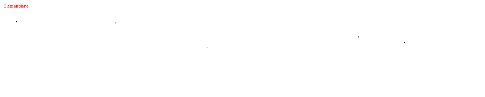
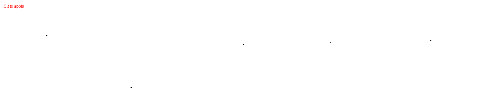
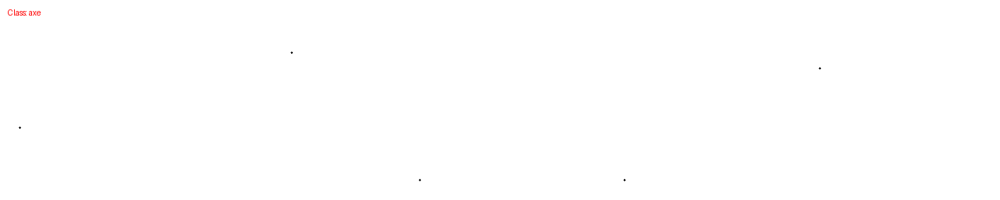
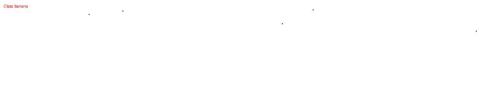
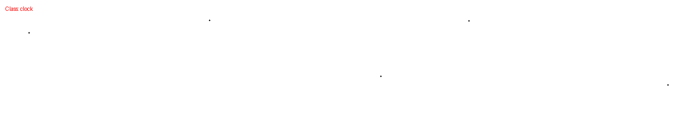
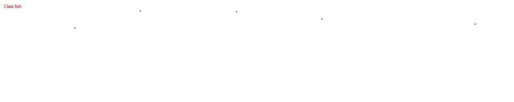
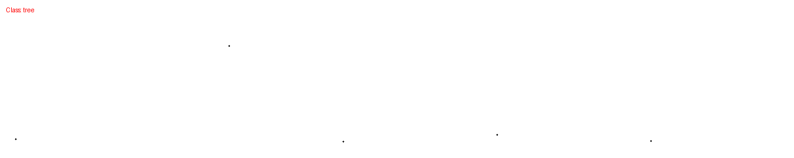
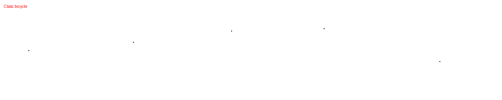
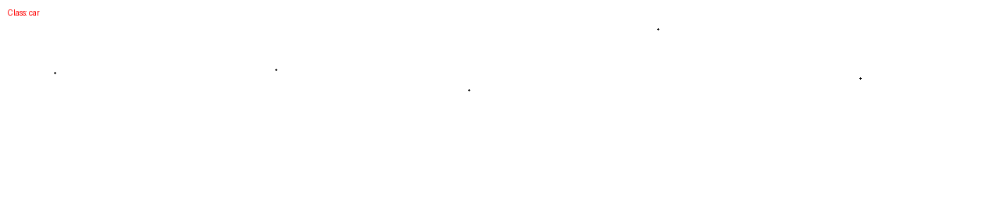

# Class-Conditioned Sketch Generation using Transformer and Mixture Density Networks

## Introduction

This project implements a class-conditioned sketch generation model capable of generating hand-drawn sketches stroke-by-stroke for multiple object categories.

The model combines:

* Transformer Decoder
* Mixture Density Network (MDN)
* Multivariate Gaussian Modeling
* Class Conditioning

Unlike image generation models that generate all pixels simultaneously, this model generates sketches sequentially by predicting the next pen movement at every timestep.

The model is trained on 10 sketch categories including:

* Airplane
* Apple
* Car
* Person
* And other object classes

The generated sketch is represented as a sequence:

```text
(dx, dy, pen_state)
```

where:

* dx = horizontal movement
* dy = vertical movement
* pen_state = pen action

Pen states:

```text
0 → Pen touching paper
1 → Pen lifted from paper
2 → End of drawing
```

---

# Results

## Airplane

<p align="center">
  
</p>

---

## Apple

<p align="center">
  
</p>

---

## Axe

<p align="center">
  
</p>
---

## banana

<p align="center">
  
</p>

---

## Clock

<p align="center">
  
</p>

---

## Fish

<p align="center">
  
</p>

---

## Tree

<p align="center">
  
</p>

---

## Bicycle

<p align="center">
  
</p>

---

## Bed

<p align="center">
  
</p>

---

## car

<p align="center">
  
</p>

---


# Google Colab

Run the project directly in Google Colab:

🔗 https://drive.google.com/file/d/1aezX3VWMCNFk0ACKBxrDmsffJzXBcRz7/view?usp=drive_link

---

# Handwritten Report

Complete derivations, architecture explanation, MDN formulation, and transformer implementation details:

📄 https://drive.google.com/file/d/1zn1ALvjiMlGd_OabT7pdogWxcDmchW7w/view?usp=drive_link

---

# Model

Download trained model weights:

📦 https://drive.google.com/file/d/1hhInijG1OUTS-9F4ggHCOMnkqXWvyVqr/view?usp=drive_link

---

# Theory

## Problem Statement

The objective is to generate realistic sketches belonging to a specific object category using sequential stroke generation.

Unlike image generation models, sketch generation is inherently sequential because a drawing is created one stroke at a time.

---

## Why Normal Regression Fails

For a given sketch point, multiple valid next drawing directions may exist.

For example, when drawing an airplane wing, the next stroke could move:

* Up
* Down
* Left
* Right

All of these directions may be valid.

Traditional regression predicts only the average of all possible directions, resulting in unrealistic sketches.

To overcome this limitation, the model predicts a probability distribution over possible next movements instead of a single coordinate.

---

## Multivariate Gaussian Distribution

The model predicts:

```text
P(dx, dy)
```

using a multivariate Gaussian distribution.

Each Gaussian component predicts:

* Mean
* Covariance
* Correlation

allowing the model to represent uncertainty in future drawing movements.

---

## Mixture Density Network (MDN)

A single Gaussian is insufficient because sketches often have multiple plausible future directions.

Therefore, the model predicts multiple Gaussian components.

For every timestep, the MDN predicts:

* Mean of each Gaussian
* Covariance of each Gaussian
* Mixture Weight of each Gaussian

The final probability distribution is a weighted combination of all Gaussian components.

---

## Transformer Decoder

The transformer learns sequential drawing patterns using:

* Stroke Embedding
* Pen-State Embedding
* Position Embedding
* Class Embedding
* Multi-Head Causal Attention
* Feed Forward Networks

The decoder predicts the next stroke conditioned on all previous strokes and the target class.

---

## Training Objective

The total loss consists of:

### Coordinate Loss

Negative log-likelihood under the predicted Gaussian mixture.

### Pen-State Loss

Categorical cross-entropy loss for pen state prediction.

### Final Loss

```text
Total Loss =
Coordinate Loss +
Pen-State Loss
```

---

## Generation Process

During inference:

1. Start from an initial stroke.
2. Predict the next stroke distribution.
3. Sample a stroke from the MDN.
4. Feed the generated stroke back into the transformer.
5. Continue until the end-of-sketch token is produced.

This enables the model to generate sketches stroke-by-stroke in an autoregressive manner.

---
## GPU
* The GPU used here is A100 Rented From Jarvis LABS

---

## Author

**Pranav Deshpande**
IIT Jodhpur
* Deep Learning 
* Generative AI 
* Sequential Modeling

